# Human Centered Design

This project we had the chance to enhance the experience of watching movies and podcasts for Marie.
Marie is deaf but loves to watch movies, this can sometimes be a bit complicated because the subtitles or closed captions are not really giving the best experience. Sometimes sounds are not registered in closed caption or it is not clear who is talking. In this four weeks I want to see if I can make her experience a bit better.

## The Interview

The first time I met Marie she told us a lot about her experiences with movies. She misses a lot of sounds off screen which can be very confusing at times. Also the closed captions are really "flat". We know that people can have very different ways of talking. Different tones, volumes, rhythms and pitches. She misses out on this kind of sounds. Also the descriptions of music and sounds is not really clear. She said: "What is spooky music? What does that sound like?"

## The Plan

The first thing that came up to mind was the closed captions. "How can I make this more interesting?" Maybe with color, thickness, style and/or animations. I sketched some ways how people could say things (in Dutch) and a scheme how I could make this variable. I thought of color and fonts and the background of the captions.

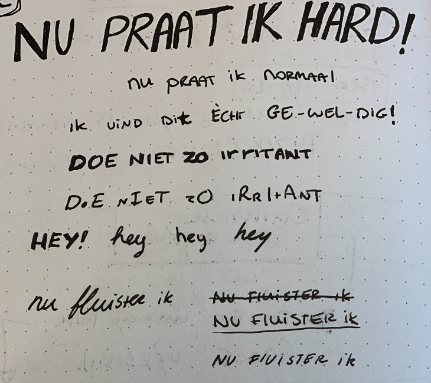
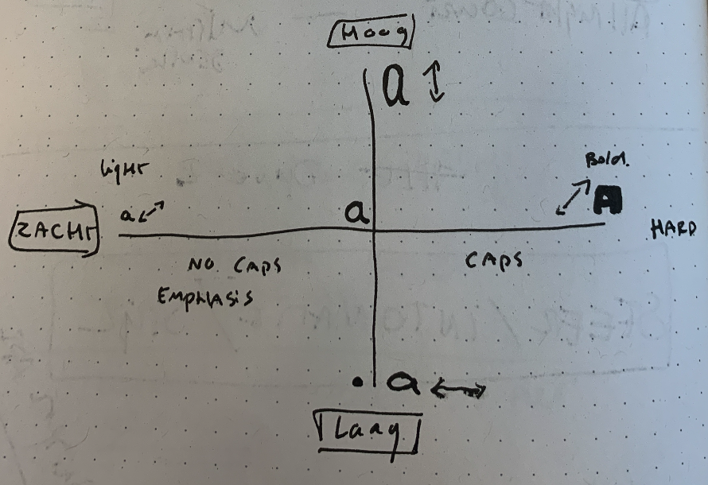
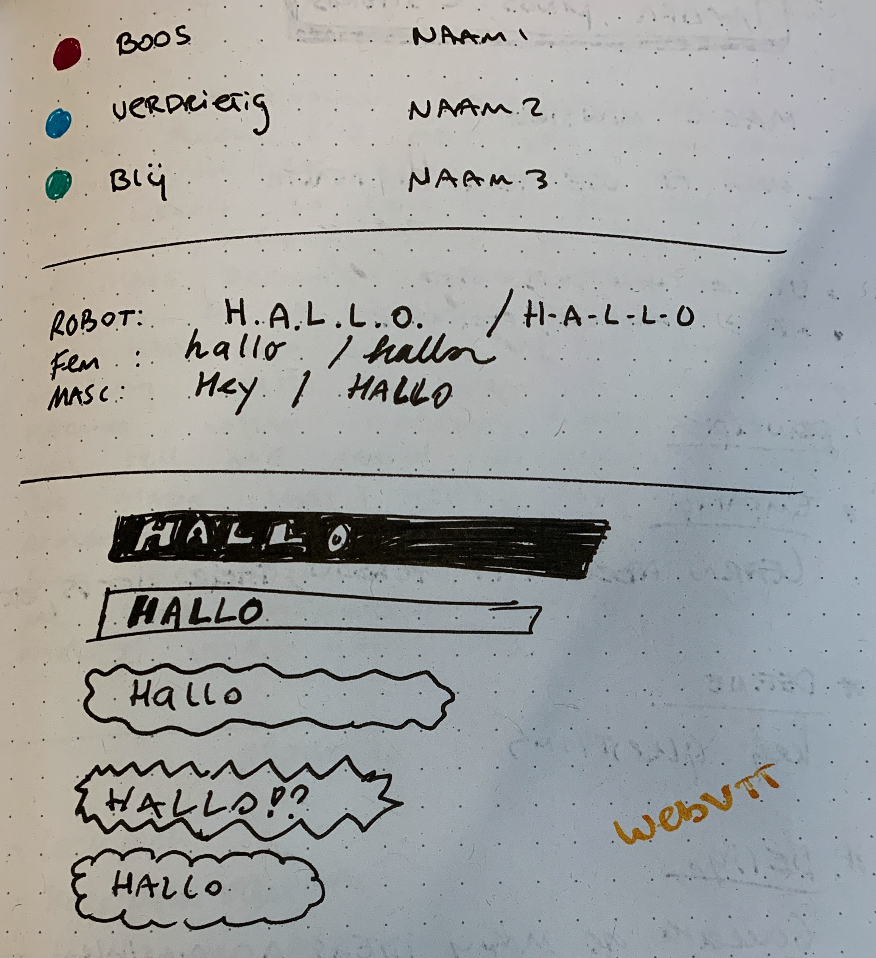

I also needed a way to make clear where the sounds come from and how the sound "feels" like. So I made some small sketches how I could implement this into the screen.

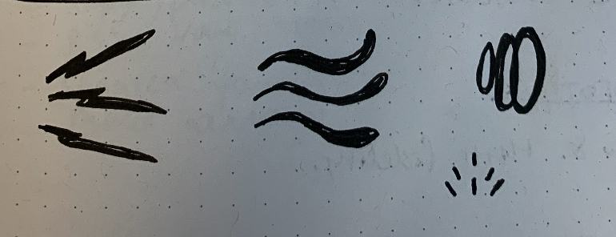

## The first Prototype

For the first prototype I took a scene out of a movie called The Menu. This is one of the movies Marie talked about, where one of the actors has a very unique voice. I wanted to use this scene because there are some different kind of voices and also music in the background which I could visualize. I had to start from scratch so in little time I had to figure out how to insert captions and "listen" to the timestamp of the video. I used a variable font "RobotoFlex" to be able to use the same font in different styles. I tried to create different styles with this font and also add a style on how loud people were talking.

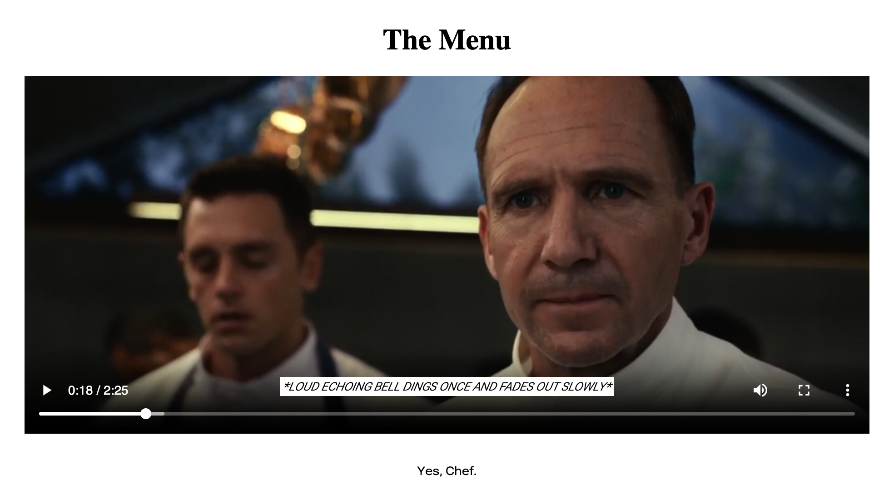

### Feedback 01

Marie liked the idea, bud had some useful feedback that I could use for the next prototype. Sometimes it was not really clear who was talking so I should add the names where this was not clear. Also the font style was not really representing the voice of the actor so I needed to add some more characteristics to that. It was still to "flat". I wasn't able to insert all the sounds into the captions and she told me she did really miss them. Some sounds where inserted but could use a better description. For example: there was a bell and the caption was "Bell dings". Her response was: "What kind of bell? Can you describe it to me". With this question I was able to empathize much better with what she needed. Also the rhythm of how people speak was a bit lacking. I knew I could really use this feedback and a lot of new ideas already came up.

## The Second Prototype

With the feedback of the first prototype I made a lot of progress. I cut the transcript in the rhythm of the actors. I gave every actor a styling that fitted them (in my opinion) and described the sounds and music in the background as specific as possible. In the end I even added small animations to the sounds to give some sort of impression on how the sound "moves".

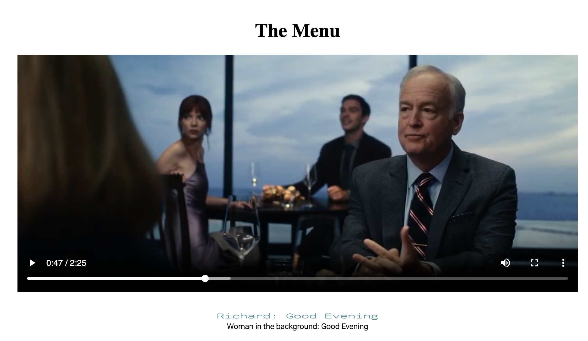</img>

### Feedback 02

Marie was really enthusiastic about my second prototype. The way I tried to mimic the way Slowik talks in the scene was much better then the first prototype. I changed the text to be a bit more how he speaks instead of using strict grammar. This really improved the visualization. The only thing here was that the font's were a little to small.

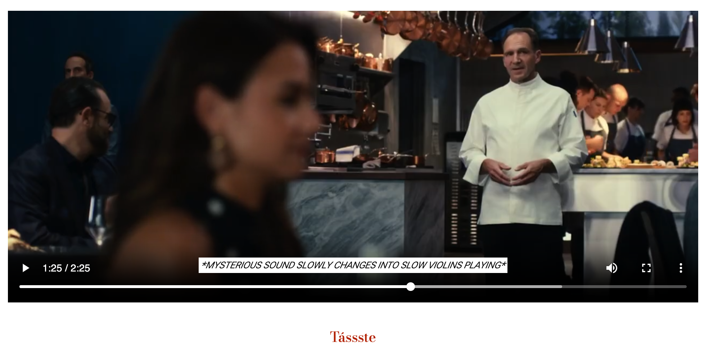

She also really liked the animations I added to the sound captions but when the animations became to fast it was a bit overwhelming so I should minimize that a bit. Also some transitions in sound were not clear. For example the way a sound transformed into violins music. She asked me how this transition felt, if it was a fast transition or a really slow one. In this case I need another way to visualize this.

## The Third Prototype

For the third prototype I tried to focus on some specific pieces of the video. The first one is the loud clap of Slowik. I tried making multiple versions of the visualization of the sound.

I started with scaling the video a bit:

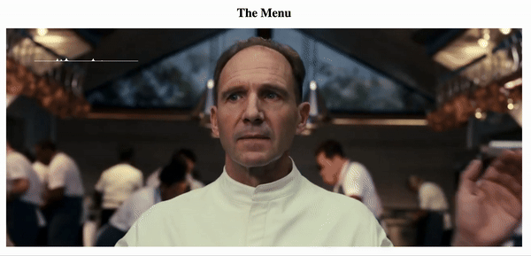

After that I tried to put a border around Slowik:

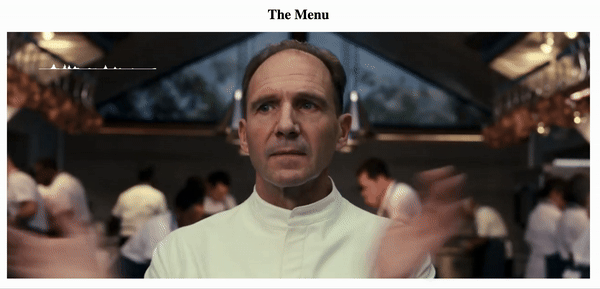

I thought it was to simple and not really affected the video so I made a mask around Slowik and added a white background to make it more flashy:

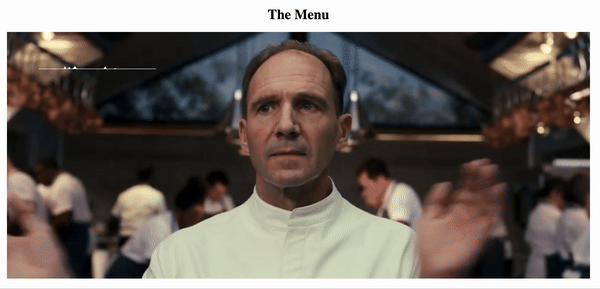

The last version I tried to make it a bit more "crazy" and added triangles around Slowik:

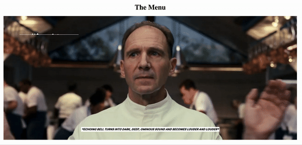

The second thing I wanted to add was more visualization for the music. I searched online for a audio viusualizer and found one from [musicvid.org](https://musicvid.org/). Here I could edit the audio visualizer a bit to what I needed.

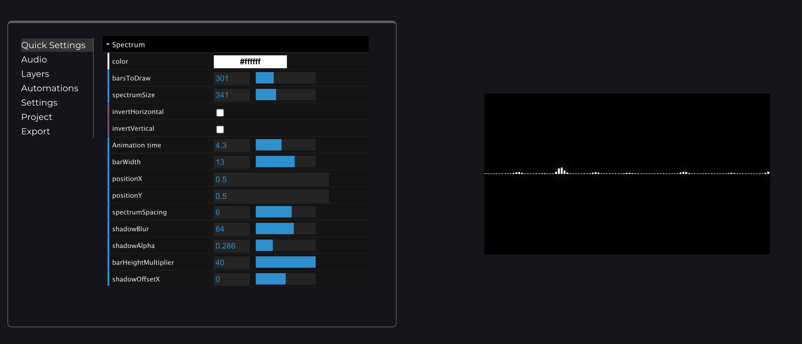

I implemented some minor feedback that Marie gave me the last time like up scaling the subtitles. I also added a new font to the music closed captions and added  a small animation on the part where Tyler breathes in.

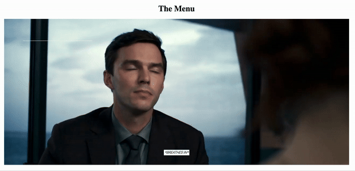

### Feedback 03

When presenting the final prototype to Marie she really enjoyed watching it. We both agreed that the version where the scale and the flashy effect came together was the best. She also liked the small animations I added and the font was perfect as it is now.

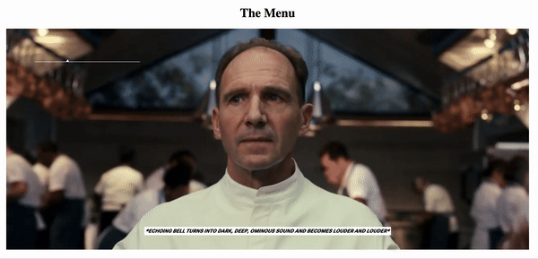

The second thing she gave me feedback on was the audio visualizer. She told me she didn't know if it was really helpful since it was a bit stuttering. We talked about how the placement and the shape of the visualizer could really improve the experience and agreed on maybe a more simple design of a 'flowy' line that only visualizes the music (in this case it visualized the music and the surrounding sounds because I couldn't split these sounds).

## What's Next

If I would continue working on this project I would probably add more small animations on sound captions and focus on a way to visualize the music. I could start looking a little bit like this:

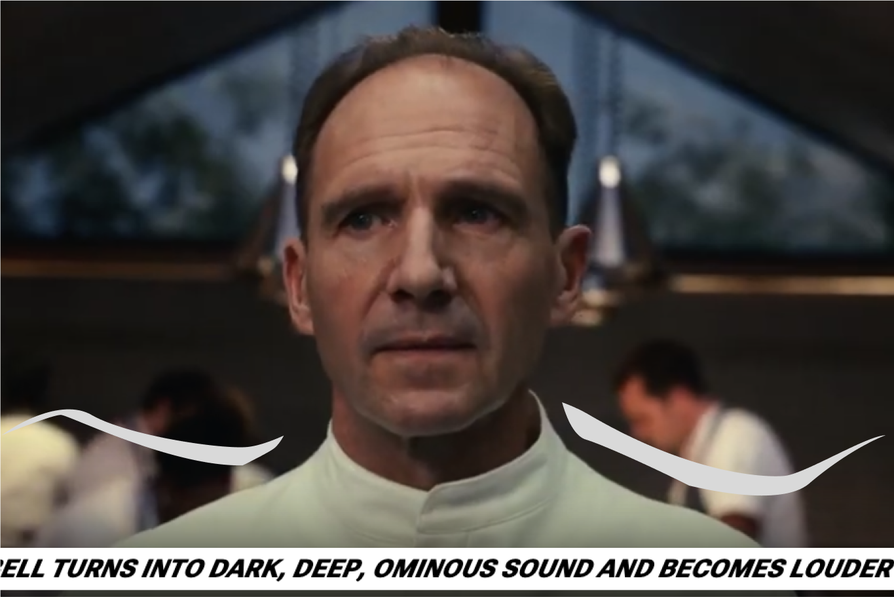

I also think the fonts could be more diverse. Now the fonts are different but you can not really identify the tone or loudness of the voices. I could add more diverse styling to the fonts, like thickness and scale, to make this more visible.

## Reflection

I really enjoyed this project and learned a lot about exclusive design. I really needed to push myself of box and learn to not rely on my own assumptions. Marie was really nice to work with and gave me very useful feedback. For the project we had to follow a couple of interesting design patterns.

### Study Situation

Every week I had a feedback session with Marie. The first session was to get to know her and her needs. The three other sessions was about showing my prototype and receive feedback. This session was not only for me but also for other students who had Marie as their client. I also learned a lot from the feedback they received. Like when to add a name before a caption and when not to.

### Ignore Conventions

Ignoring conventions can lead to really interesting results. For example you would think people would not want to see closed captions in the middle of the screen, animated text or flashy animations when watching a movie. By testing this and ignoring the conventions I actually found out that in some cases this can actually be something that someone needs!

### Prioritize Identity

This project was all about exclusive design, in this case for Marie. I took a movie scene from a movie that Marie liked and tried to make the experience of this specific scene a lot more fun to watch. She really wanted to know the way a character - called Slowik - talks. In the end she could really make something out of the captions and recognize his personality.

### Add Nonsense

Adding nonsense could be dangerous, but in most cases the results are very interesting. I started playing with a specific part in the scene where Slowik claps his hand. This creates a really loud sound and is an iconic piece of the scene. I tried to think outside the box with creating background effects and scaling the video. I started noticing that some versions were to crazy but I showed them to Marie anyway. This resulted in understanding more about the feeling I wanted to bring across. In first instance I thought the flash and the scale would be 'to much' but ended up being the best choice for this piece of the scene.